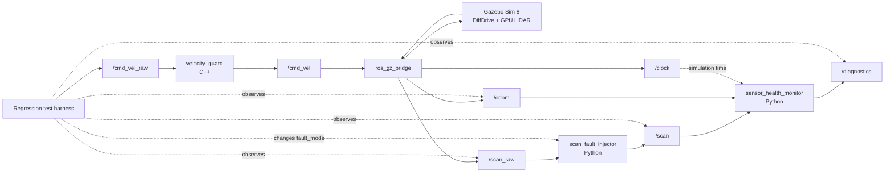

# ROS 2 Automated Testing & CI Robot

[](https://github.com/BossBykes/ros2-ci-robot/actions/workflows/ci.yml)


A Docker-isolated ROS 2 Jazzy project that demonstrates automated testing, fault injection, simulation-based regression testing, and GitHub Actions CI for a differential-drive robot.

The goal is not simply to make a robot move in Gazebo. The project is designed to demonstrate the engineering practices required to make a robotics software stack **repeatable, testable, diagnosable, and safe to run automatically in CI**.

## What this project demonstrates

- Mixed **C++ and Python ROS 2 nodes**
- Unit testing with **GoogleTest** and **pytest**
- ROS 2 integration testing with **launch_testing**
- Real headless **Gazebo Sim 8 / Gazebo Harmonic** system tests
- Runtime **sensor fault injection**
- Runtime **diagnostics and sensor-health monitoring**
- Closed-loop **waypoint navigation regression testing**
- Hard timeouts around simulation and test execution
- Clean Gazebo / ROS process shutdown after automated tests
- Docker-based reproducible development and CI environments
- GitHub Actions builds and regression tests on pushes and pull requests
- Automated JUnit, pytest, CTest, and colcon-log artifact collection

## System architecture



The command and sensor pipelines are:

```text
/cmd_vel_raw
    -> velocity_guard
    -> /cmd_vel
    -> ros_gz_bridge
    -> Gazebo DiffDrive
    -> /odom
```

and:

```text
Gazebo GPU LiDAR
    -> /scan_raw
    -> scan_fault_injector
    -> /scan
    -> sensor_health_monitor
    -> /diagnostics
```

Gazebo `/clock` is also bridged into ROS. The sensor-health monitor runs with simulation time during Gazebo regression testing.

## ROS 2 packages

| Package | Language / type | Responsibility |
|---|---|---|
| `ci_bot_control` | C++ / `ament_cmake` | Validates velocity commands, clamps excessive velocities, rejects invalid numeric input, and stops the robot when commands time out |
| `ci_bot_description` | Xacro / `ament_cmake` | Differential-drive robot model, wheel geometry, caster, LiDAR frame, Gazebo DiffDrive plugin, and GPU LiDAR |
| `ci_bot_fault_injection` | Python / `ament_python` | Injects controlled faults into the LiDAR pipeline at runtime |
| `ci_bot_monitor` | Python / `ament_python` | Monitors LiDAR and odometry freshness / validity and publishes ROS diagnostics |
| `ci_bot_sim` | ROS 2 launch + Gazebo / `ament_cmake` | Headless simulation, bridge configuration, deterministic world, and real Gazebo system-regression tests |

## Velocity guard

`ci_bot_control` exposes:

```text
/cmd_vel_raw -> velocity_guard -> /cmd_vel
```

Default safety parameters:

| Parameter | Default |
|---|---:|
| `max_linear_velocity` | `0.5 m/s` |
| `max_angular_velocity` | `1.5 rad/s` |
| `command_timeout_seconds` | `0.5 s` |

The node:

- passes valid commands
- clamps excessive linear and angular velocity
- rejects NaN / infinite command values
- publishes a zero-velocity command after the watchdog timeout

## Fault injection

The LiDAR fault injector sits between raw simulated sensor data and the monitored scan topic:

```text
/scan_raw -> scan_fault_injector -> /scan
```

The `fault_mode` parameter can be changed dynamically while the simulation is running.

| Mode | Behaviour |
|---|---|
| `normal` | Deep-copies and forwards the Gazebo scan unchanged |
| `drop` | Suppresses the outgoing scan entirely |
| `nan` | Replaces the first range value with NaN |
| `stale` | Moves the LaserScan timestamp backwards |

The stale offset defaults to:

```text
stale_offset_seconds = 5.0
```

## Runtime sensor monitoring

`sensor_health_monitor` subscribes to:

```text
/scan
/odom
```

and publishes:

```text
/diagnostics
```

Default monitoring parameters:

| Parameter | Default |
|---|---:|
| `scan_timeout_seconds` | `1.0 s` |
| `odom_timeout_seconds` | `1.0 s` |
| `check_period_seconds` | `0.1 s` |

It detects:

- missing LiDAR messages
- stale nonzero LaserScan timestamps
- NaN / invalid LiDAR ranges
- missing odometry
- invalid odometry data

Zero LaserScan timestamps intentionally fall back to message receipt time. Odometry freshness is based on receipt time.

Diagnostic entries are published as:

```text
ci_bot/scan
ci_bot/odom
```

with states such as:

```text
OK
SENSOR_TIMEOUT
INVALID_DATA
```

## Automated test strategy

The repository uses multiple test layers rather than relying on a single end-to-end test.

### 1. C++ unit tests

`ci_bot_control/test/test_velocity_guard.cpp`

GoogleTest verifies:

- valid command pass-through
- excessive velocity clamping
- NaN rejection
- infinity rejection

### 2. ROS 2 launch integration tests

`ci_bot_control/test/test_velocity_guard_launch.py`

A real `velocity_guard_node` is launched and tested for:

- command pass-through
- velocity clamping
- watchdog stop behaviour
- clean process exit

The launch test has a hard CTest timeout of **30 seconds**.

### 3. Fault-injection unit tests

`ci_bot_fault_injection/test/test_fault_logic.py`

pytest verifies:

- normal forwarding
- dropped scans
- NaN injection
- stale timestamp injection
- rejection of unknown fault modes

### 4. Sensor-monitor tests

`ci_bot_monitor/test/`

Unit and integration tests verify:

- healthy sensors
- sensor timeout
- invalid data
- valid infinite LiDAR ranges
- NaN LiDAR rejection
- healthy scan + odometry diagnostics
- missing-sensor diagnostics
- stale LaserScan timestamp detection

### 5. Real Gazebo system regression

`ci_bot_sim/test/test_gazebo_movement.py`

A single headless Gazebo launch-testing session currently executes **six real simulation tests**:

#### Healthy LiDAR pipeline

- waits for real Gazebo `/scan_raw`
- verifies `laser_frame`
- verifies 360 ranges
- verifies a finite obstacle return
- confirms the deterministic test wall is detected within 3 m
- matches raw and forwarded scans
- proves `normal` fault mode preserves ranges
- verifies LiDAR and odometry diagnostics are healthy

#### Physical robot movement

Commands:

```text
/cmd_vel_raw
```

and verifies from real Gazebo `/odom` that the simulated robot physically moves forward.

This exercises:

```text
test publisher
-> velocity_guard
-> ros_gz_bridge
-> Gazebo DiffDrive
-> odometry
```

#### Dropped-LiDAR fault

- switches `fault_mode` to `drop`
- proves raw Gazebo LiDAR continues
- verifies `/scan` disappears
- verifies `ci_bot/scan = SENSOR_TIMEOUT`
- verifies odometry remains healthy

#### NaN-LiDAR fault

- switches `fault_mode` to `nan`
- proves raw Gazebo LiDAR remains healthy
- verifies the forwarded first range becomes NaN
- verifies remaining ranges are preserved
- verifies `ci_bot/scan = INVALID_DATA`
- verifies odometry remains healthy

#### Stale-timestamp fault

- switches `fault_mode` to `stale`
- verifies the outgoing LaserScan timestamp is exactly 5 seconds older
- verifies LiDAR ranges themselves are unchanged
- uses Gazebo simulation time
- verifies `ci_bot/scan = SENSOR_TIMEOUT`
- verifies odometry remains healthy

#### Waypoint navigation regression

The system test executes a deterministic closed-loop L-shaped trajectory using real odometry feedback:

```text
start
  -> drive 0.5 m
  -> rotate approximately 90 degrees
  -> drive 0.5 m
  -> settle to the requested final heading
```

Commands still enter through `/cmd_vel_raw`, so the test exercises the real velocity guard, bridge, Gazebo physics, DiffDrive system, and odometry feedback loop.

The test checks waypoint position and heading tolerances instead of merely checking that velocity commands were published.

This is intentionally a lightweight odometry-based regression controller rather than Nav2. The objective is to test system behaviour deterministically without adding the complexity of a full navigation stack.

The complete Gazebo launch test has a hard CTest timeout of **40 seconds** and normally completes in about **20 seconds**.

## Current regression result

The authored test suite contains:

| Test layer | Authored test cases |
|---|---:|
| C++ GoogleTest | 4 |
| Velocity-guard launch tests | 4 |
| Fault-injection pytest tests | 5 |
| Sensor-monitor pytest tests | 8 |
| Real Gazebo system tests | 6 |
| **Total authored test cases** | **27** |

`colcon test-result` currently reports:

```text
Summary: 30 tests, 0 errors, 0 failures, 0 skipped
```

The difference between 27 authored test cases and 30 colcon result entries comes from three CTest wrapper entries generated around the CMake / launch-testing suites.

Before documentation was added, the regression suite was also stress-tested with:

- 3 consecutive Gazebo-only regression launches
- 3 consecutive complete five-package regression runs
- clean ROS / Gazebo shutdown after every run

All repeated runs passed without failure.

## GitHub Actions CI

The workflow is defined in:

```text
.github/workflows/ci.yml
```

It runs automatically on:

```text
push
pull_request
```

on:

```text
ubuntu-24.04
```

The CI pipeline performs:

```text
checkout
  -> capture runner UID/GID
  -> build Docker image with Buildx
  -> build ROS 2 workspace
  -> run complete regression suite
  -> run colcon test-result
  -> publish GitHub step summary
  -> upload test artifacts
```

The Docker image is built with the GitHub runner's UID/GID so bind-mounted workspace files remain writable inside CI.

Hard outer limits are applied around the major ROS commands:

```text
colcon build: 180 s
colcon test:  120 s
GitHub job:   20 min
```

The Gazebo launch test additionally retains its own internal 40-second CTest timeout.

## Automated test artifacts

Test evidence is uploaded from every CI run and retained for 14 days.

The artifact contains:

```text
ros2_ws/build/**/test_results/**
ros2_ws/build/**/pytest.xml
ros2_ws/build/**/Testing/**
ros2_ws/log/**
```

This preserves:

- GoogleTest XML
- launch-testing JUnit XML
- pytest XML
- CTest result files
- colcon build logs
- colcon test logs

Artifacts are uploaded even when an earlier CI step fails, making failed regressions easier to diagnose.

## Docker isolation

ROS 2 and Gazebo dependencies live entirely inside Docker.

The development container:

- uses ROS 2 Jazzy on Ubuntu 24.04
- includes Gazebo Harmonic / Gazebo Sim 8
- mounts only this repository at `/workspace`
- does not mount host `/opt/ros`
- does not mount any other ROS workspace
- does not use host networking
- uses `ROS_DOMAIN_ID=77`
- uses a private Docker bridge network
- allocates 1 GB shared memory for DDS / Gazebo

This prevents the project from interfering with unrelated ROS environments on the host.

## Process-lifecycle reliability

Gazebo is launched directly with ROS 2 `ExecuteProcess`:

```python
ExecuteProcess(
    cmd=["gz", "sim", ...],
    shell=False,
)
```

This is deliberate.

An earlier launch approach indirectly used a shell and could leave orphaned `gz sim` processes after `launch_testing` shutdown. The current launch configuration has been verified to terminate Gazebo cleanly on SIGINT.

The Python nodes also perform guarded `rclpy.shutdown()` cleanup so automated test shutdown does not generate unnecessary exceptions.

## Deterministic simulation world

The test world is intentionally minimal:

- flat `20 x 20 m` ground plane
- deterministic static LiDAR test wall
- headless rendering
- fixed physics configuration

The test wall is placed at approximately:

```text
x = 2.0 m
```

from the robot's initial area so the LiDAR test can make deterministic assertions about real simulated obstacle returns.

## Quick start

### Requirements

The host only needs:

- Docker
- Docker Compose
- Git

ROS 2 and Gazebo do **not** need to be installed on the host.

Clone the repository:

```bash
git clone git@github.com:BossBykes/ros2-ci-robot.git
cd ros2-ci-robot
```

Build the development image:

```bash
docker compose build
```

Start the isolated development container:

```bash
docker compose up -d
```

Build the ROS 2 workspace:

```bash
docker compose exec dev bash -lc \
  'cd /workspace/ros2_ws && colcon build --symlink-install'
```

Run the complete regression suite:

```bash
docker compose exec dev bash -lc \
  'cd /workspace/ros2_ws && \
   source install/setup.bash && \
   timeout --signal=INT --kill-after=10s 120s \
   colcon test --return-code-on-test-failure'
```

Inspect the aggregated result:

```bash
docker compose exec dev bash -lc \
  'cd /workspace/ros2_ws && colcon test-result --verbose'
```

Run only the real Gazebo system regression:

```bash
docker compose exec dev bash -lc \
  'cd /workspace/ros2_ws && \
   source install/setup.bash && \
   timeout --signal=INT --kill-after=10s 60s \
   colcon test \
     --packages-select ci_bot_sim \
     --return-code-on-test-failure \
     --event-handlers console_direct+'
```

Stop the development environment:

```bash
docker compose down
```

## Repository structure

```text
.
├── .github/
│   └── workflows/
│       └── ci.yml
├── docker/
│   └── entrypoint.sh
├── ros2_ws/
│   └── src/
│       ├── ci_bot_control/
│       ├── ci_bot_description/
│       ├── ci_bot_fault_injection/
│       ├── ci_bot_monitor/
│       └── ci_bot_sim/
├── .dockerignore
├── .gitignore
├── compose.yaml
├── Dockerfile
└── README.md
```

## Engineering focus

This repository is intentionally small enough to understand quickly but deep enough to exercise realistic robotics-development concerns:

- command safety
- asynchronous ROS communication
- simulation
- runtime parameter changes
- sensor corruption
- timeout detection
- diagnostics
- physics-based regression testing
- closed-loop robot behaviour
- process cleanup
- deterministic CI
- failure artifacts

The project therefore serves as a compact example of how robotics software can be treated like production software rather than as a collection of manually tested ROS nodes.

## Technology stack

- ROS 2 Jazzy Jalisco
- Ubuntu 24.04
- Gazebo Harmonic / Gazebo Sim 8
- `ros_gz`
- C++17
- Python 3
- GoogleTest
- pytest
- `launch_testing`
- colcon
- Docker / Docker Compose
- GitHub Actions
